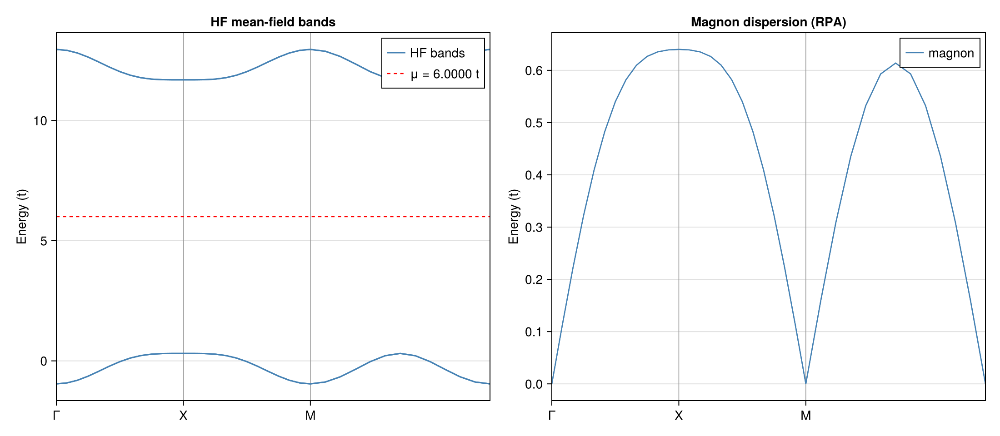

# MeanFieldTheories.jl

**MeanFieldTheories.jl** is a Julia package for studying quantum many-body systems using mean-field theory and related methods. It provides a complete workflow from constructing many-body Hamiltonians to obtaining self-consistent ground states and calculating collective excitation spectra.

See documents: https://Quantum-Many-Body.github.io/MeanFieldTheories.jl/dev

## Features

- **Fully customizable quantum system** Degrees of freedom (site, sublattice, spin, orbital, valley, …) are freely defined by the user via `SystemDofs`, with user-specified constraints.

-  **High flexibility for generating operator representations** DOF index constraints can be applied directly to `generate_onebody` and `generate_twobody` to select only the desired terms on each bond. 

-  **Highly free forms of interaction** Two-body interaction allows four different site index $(i,j,k,l)$. The creation-annihilation ordering of the operator string is also arbitrary and handled automatically.

- **Unrestricted Hartree-Fock in both real and momentum space.** All four Wick contraction channels (Hartree and Fock, both pairs) are kept open with no preset symmetry breaking.

- **Complete post-HF excitation spectrum.** On top of the mean-field ground state, collective modes are accessible using BSE/TDA and RPA, yielding dynamic structure factors and excitation gaps directly.

## Installation

```julia
using Pkg
Pkg.develop(url="https://github.com/Quantum-Many-Body/MeanFieldTheories.jl")
```

## Quick Start: AFM Magnon Dispersion



This example computes the magnon (spin-wave) dispersion of a Néel antiferromagnet on a square lattice, demonstrating the full workflow: Hamiltonian construction, self-consistent Hartree-Fock, and collective excitation spectrum via RPA. The RPA magnon dispersion (right panel) shows a gapless Goldstone mode at $\Gamma$, confirming the spontaneous breaking of SU(2) spin symmetry in the Néel state. The left panel shows the mean-field quasiparticle bands with the Mott gap.

The Hubbard model at half-filling with $U/t = 12$ on a $\sqrt{2} \times \sqrt{2}$ rotated magnetic unit cell (2 sublattices, 4 orbitals per cell):

$$H = -t \sum_{\langle ij \rangle,\sigma} c^\dagger_{i\sigma}c_{j\sigma} + U \sum_i n_{i\uparrow}n_{i\downarrow}$$

**Step 1: Define the quantum system and Hamiltonian**

```julia
using MeanFieldTheories

# Magnetic unit cell: √2 × √2 rotated square lattice
a1 = [1.0, 1.0];  a2 = [1.0, -1.0]

unitcell = Lattice(
    [Dof(:cell, 1), Dof(:sub, 2, [:A, :B])],
    [QN(cell=1, sub=1), QN(cell=1, sub=2)],
    [[0.0, 0.0], [1.0, 0.0]];
    vectors = [a1, a2]
)

dofs = SystemDofs([Dof(:cell, 1), Dof(:sub, 2, [:A, :B]), Dof(:spin, 2, [:up, :dn])])

t = 1.0;  U = 12.0
nn_bonds     = bonds(unitcell, (:p, :p), 1)
onsite_bonds = bonds(unitcell, (:p, :p), 0)

onebody = generate_onebody(dofs, nn_bonds,
    (delta, qn1, qn2) -> qn1.spin == qn2.spin ? -t : 0.0)

twobody = generate_twobody(dofs, onsite_bonds,
    (deltas, qn1, qn2, qn3, qn4) ->
        (qn1.spin == qn2.spin) && (qn3.spin == qn4.spin) &&
        (qn1.spin !== qn3.spin) ? U/2 : 0.0,
    order = (cdag, :i, c, :i, cdag, :i, c, :i))
```

**Step 2: Solve the Hartree-Fock ground state**

```julia
Nk_hf   = 12
kpoints = build_kpoints([a1, a2], (Nk_hf, Nk_hf))
n_elec  = 2 * length(kpoints)   # half-filling

hf = solve_hfk(dofs, onebody, twobody, kpoints, n_elec;
    n_restarts = 10, field_strength = 1.0, n_warmup = 10, tol = 1e-12)
```

The converged ground state shows Néel antiferromagnetic order:

```julia
mags = local_spin(dofs, hf.G_k)
print_spin(mags)
```
```
cell/sub                     n        mx        my        mz       |m|      θ(°)      φ(°)
──────────────────────────────────────────────────────────────────────────────────────────
1/1                     1.0000    0.1336   -0.4546   -0.0179    0.4742     92.17    -73.63
1/2                     1.0000   -0.1336    0.4546    0.0179    0.4742     87.83    106.37

Local spin moments (A and B sublattices):
  A: mx=0.1336  my=-0.4546  mz=-0.0179
  B: mx=-0.1336  my=0.4546  mz=0.0179
  Staggered magnetization |mz_A - mz_B|/2 = 0.948321
```

**Step 3: Compute the magnon dispersion via RPA**

```julia
B_mat = 2π * inv(hcat(a1, a2))'
reciprocal_vecs = [B_mat[:, 1], B_mat[:, 2]]

# q-path: Γ → X → M → Γ (original square BZ)
qpoints = ...  # see examples/AFM_Magnon/run.jl for full q-path construction

ph = solve_ph_excitations(dofs, onebody, twobody, hf, qpoints, reciprocal_vecs;
    solver = :RPA)
```

Run the full example:
```
julia --project=examples -t 8 examples/AFM_Magnon/run.jl
```


## Package Structure

- **quantumsystem**: Core quantum system definitions, lattice structures, and operator algebra
- **groundstate**: Ground state calculations using Hartree-Fock and mean-field methods
- **excitations**: Excited state calculations using BSE/TDA and RPA.

## Citation

If you use this package in your research, please cite:

```bibtex
@software{meanfieldtheories,
  author = {Yong-Yue Zong},
  title = {MeanFieldTheories.jl: A Julia package for quantum many-body systems using mean-field theory and related methods},
  year = {2026},
  url = {https://github.com/Quantum-Many-Body/MeanFieldTheories.jl}
}
```

## Contributing

Contributions are welcome! Please feel free to submit issues or pull requests on [GitHub](https://github.com/Quantum-Many-Body/MeanFieldTheories.jl).

## Contact

Yong-Yue Zong — [zongyongyue@gmail.com](mailto:zongyongyue@gmail.com)

## License

This project is licensed under the MIT License - see the LICENSE file for details.
