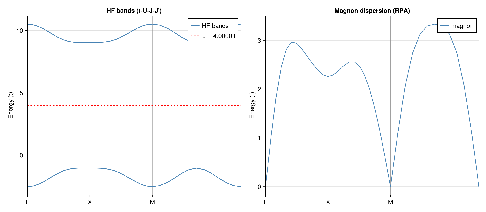

# Example: Magnon Dispersion in the t-U-J-J' Model

This example computes the magnon dispersion of the square-lattice t-U-J-J' model at half-filling using RPA on top of Hartree-Fock. It demonstrates how nearest-neighbor ($J$) and next-nearest-neighbor ($J'$) Heisenberg exchange interactions modify the spin-wave spectrum, and verifies the **Goldstone theorem** in the presence of these additional couplings.

## Physical Model

$$H = -t \sum_{\langle ij \rangle,\sigma} (c^\dagger_{i\sigma}c_{j\sigma} + \text{h.c.}) + U \sum_i n_{i\uparrow}n_{i\downarrow} + J \sum_{\langle ij \rangle} \mathbf{S}_i \cdot \mathbf{S}_j + J' \sum_{\langle\langle ij \rangle\rangle} \mathbf{S}_i \cdot \mathbf{S}_j$$

- $t = 1$: nearest-neighbor hopping
- $U = 8$: on-site Hubbard repulsion
- $J = 1$: nearest-neighbor Heisenberg exchange ($J > 0$: antiferromagnetic)
- $J' = 0.3$: next-nearest-neighbor Heisenberg exchange ($J' > 0$: frustrating)

The Heisenberg interaction is decomposed as:

$$\mathbf{S}_i \cdot \mathbf{S}_j = \frac{1}{2}(S^+_i S^-_j + S^-_i S^+_j) + S^z_i S^z_j$$

The NN coupling $J$ reinforces the Néel antiferromagnetic order already favored by the Hubbard $U$ term, while the NNN coupling $J'$ introduces **frustration** — it connects same-sublattice sites and competes with Néel order.

## Magnetic Unit Cell

A $\sqrt{2}\times\sqrt{2}$ rotated unit cell with $\mathbf{a}_1 = (1,1)$, $\mathbf{a}_2 = (1,-1)$ containing two sublattices A and B (4 orbitals: A↑, A↓, B↑, B↓). Half-filling: 2 electrons per cell.

## Method

1. **Hartree-Fock**: momentum-space unrestricted HF (`solve_hfk`) on a $12\times12$ $k$-grid with symmetry-breaking restarts.
2. **RPA magnon spectrum**: `solve_ph_excitations` with `solver=:RPA` along the path $\Gamma \to X \to M \to \Gamma$ (original square-lattice BZ).

## Code

The Heisenberg interaction is defined using the `generate_twobody` interface with operator ordering `(cdag, :i, c, :i, cdag, :j, c, :j)` — density-like pairing on two distinct sites:

```julia
# Heisenberg S_i · S_j for an arbitrary bond set and coupling strength
function heisenberg_interaction(dofs, bond_set, coupling)
    generate_twobody(dofs, bond_set,
        (deltas, qn1, qn2, qn3, qn4) -> begin
            s1, s2, s3, s4 = qn1.spin, qn2.spin, qn3.spin, qn4.spin
            if (s1, s2, s3, s4) == (1, 2, 2, 1)         # S⁺_i S⁻_j
                return coupling / 2
            elseif (s1, s2, s3, s4) == (2, 1, 1, 2)     # S⁻_i S⁺_j
                return coupling / 2
            elseif s1 == s2 && s3 == s4                  # Sᶻ_i Sᶻ_j
                return s1 == s3 ? coupling / 4 : -coupling / 4
            else
                return 0.0
            end
        end,
        order = (cdag, :i, c, :i, cdag, :j, c, :j))
end

heisen_nn  = heisenberg_interaction(dofs, nn_bonds,  J)
heisen_nnn = heisenberg_interaction(dofs, nnn_bonds, Jp)

# Combine Hubbard U + NN Heisenberg J + NNN Heisenberg J'
twobody = (ops   = [hubbard.ops;    heisen_nn.ops;    heisen_nnn.ops],
           delta = [hubbard.delta;  heisen_nn.delta;  heisen_nnn.delta],
           irvec = [hubbard.irvec;  heisen_nn.irvec;  heisen_nnn.irvec])
```

### Goldstone theorem check

The Heisenberg terms $J \mathbf{S}_i \cdot \mathbf{S}_j$ and $J' \mathbf{S}_i \cdot \mathbf{S}_j$ are both SU(2)-invariant. Combined with the Hubbard $U$ (also SU(2)-invariant), the full Hamiltonian preserves continuous spin rotation symmetry. When the HF ground state spontaneously breaks this symmetry into the Néel state, the Goldstone theorem guarantees a gapless magnon at $\mathbf{q} = \Gamma$.

## Running the Example

```bash
# Step 1: HF + RPA calculation
julia --project=examples -t 8 examples/Heisenberg/run.jl

# Step 2: plot
julia --project=examples examples/Heisenberg/plot.jl
```

## Results



**Left panel**: HF mean-field band structure. The Néel order opens a Mott gap, with the gap size controlled by $U$ and modified by $J$, $J'$.

**Right panel**: RPA magnon dispersion. The lowest branch is gapless at $\Gamma$ (Goldstone mode). Compared to the pure Hubbard model ($J = J' = 0$), the NN Heisenberg coupling $J$ enhances the magnon bandwidth, while the frustrating NNN coupling $J'$ softens the magnon at $X = (\pi, 0)$ — a precursor to potential incommensurate magnetic order at larger $J'/J$.
