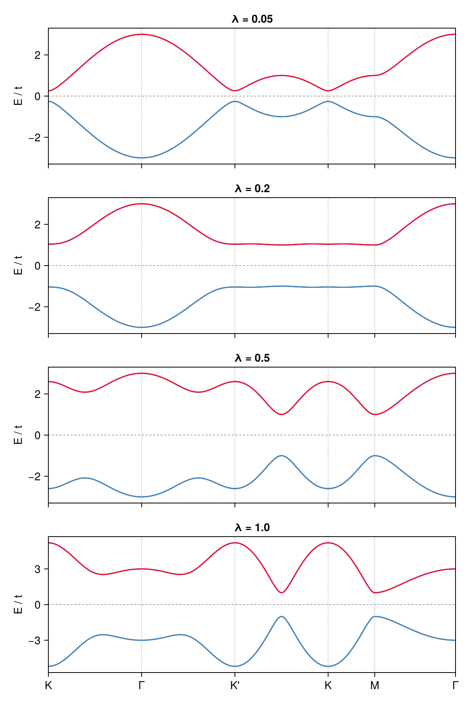
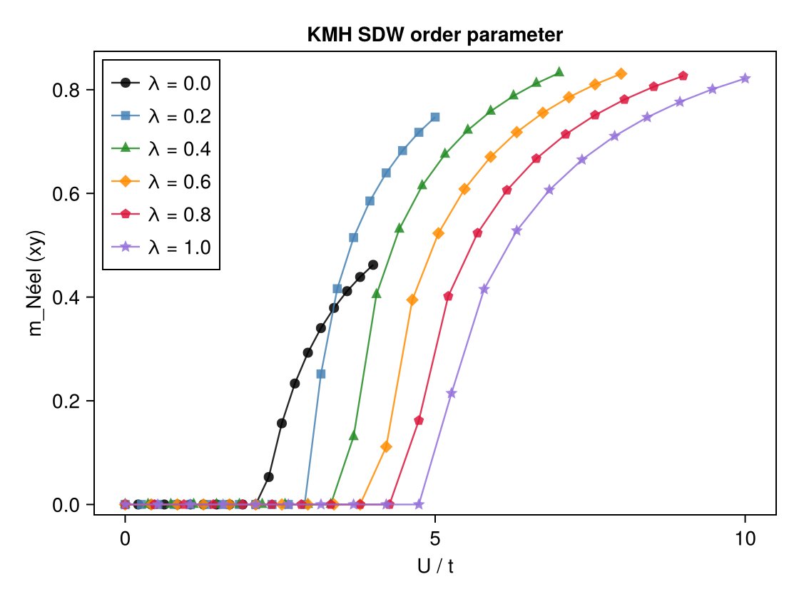
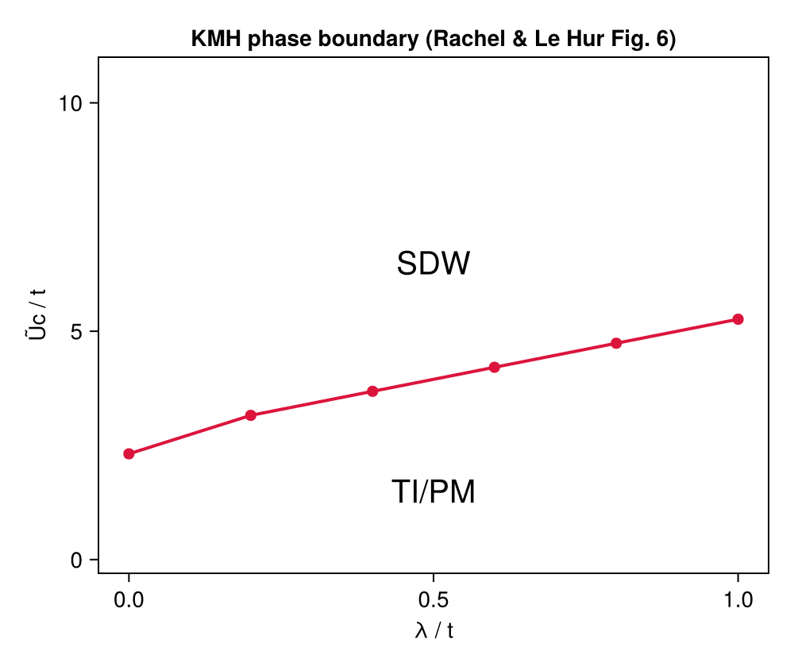

# Example: Kane-Mele-Hubbard Model — SDW Phase Boundary

This example reproduces Figs. 5 and 6 of Ref. [1]: the non-interacting Kane-Mele band structure and the spin-density-wave (SDW) phase boundary $U_c$ vs $\lambda$ of the Kane-Mele-Hubbard (KMH) model on the honeycomb lattice at half-filling.

## Physical Model

$$H = -t \sum_{\langle ij \rangle,\sigma} (c^\dagger_{i\sigma}c_{j\sigma} + \text{h.c.})
    + i\lambda \sum_{\langle\langle ij \rangle\rangle,\sigma\sigma'} \nu_{ij} \sigma^z_{\sigma\sigma'} c^\dagger_{i\sigma}c_{j\sigma'} + \text{h.c.}
    + U \sum_i n_{i\uparrow}n_{i\downarrow}$$

- $t$: nearest-neighbor (NN) hopping (set to 1)
- $\lambda$: next-nearest-neighbor (NNN) spin-orbit coupling (Kane-Mele SOC)
- $U$: on-site Coulomb repulsion
- $\nu_{ij} = +1$ ($-1$) if the NNN hop from $j$ to $i$ turns counterclockwise (clockwise)

The NNN SOC term can be written compactly as $\lambda \exp(i\sigma\nu_{ij}\pi/2)$, where $\sigma = \pm 1$ for spin up/down. At $\lambda = 0$ the model reduces to the honeycomb Hubbard model with AFM transition at $U_c \approx 2.2t$. A finite $\lambda$ breaks time-reversal symmetry and drives the system into a topological insulator (TI) phase at small $U$, which is pushed into the SDW phase at large $U$. The HF SDW order develops in the **$xy$-plane** (transverse to the $z$-axis of the SOC), with the Néel vector lying in the $xy$-plane.

The order parameter is

$$m^\text{Néel}_{xy} = \sqrt{(m^x_A - m^x_B)^2 + (m^y_A - m^y_B)^2}$$

where $m^{x,y}_s = \text{Re/Im}\langle c^\dagger_{s\uparrow} c_{s\downarrow} \rangle$ is read from the off-diagonal (spin-flip) block of the local Green's function.

## Method

The calculation uses **momentum-space unrestricted Hartree-Fock** (`solve_hfk`) on a $100 \times 100$ $k$-grid (10000 $k$-points). For each $\lambda$, the interaction $U$ is swept from **high to low** with a warm-start strategy:

- **First point** (largest $U$): 5 random symmetry-breaking restarts with `field_strength=1.0` to find the SDW ordered state.
- **Subsequent points**: warm-start from the converged Green's function of the previous $U$ with a single restart, following the order parameter continuously down to zero.

This high-to-low scan is more efficient than scanning low-to-high because the ordered state at large $U$ is easier to find and provides a good initial guess for smaller $U$.

### Critical detail: symmetric Hubbard interaction

The xy-plane SDW order requires the Hartree-Fock effective Hamiltonian to support spin-flip off-diagonal elements. This is only possible if the interaction tensor $V_{\sigma_1\sigma_2\sigma_3\sigma_4}$ is fully Hermitian. The standard shorthand `(1,1,2,2) == U` defines only $V_{\uparrow\uparrow\downarrow\downarrow} = U$ and misses $V_{\downarrow\downarrow\uparrow\uparrow} = U$, breaking Hermiticity and making the xy-SDW inaccessible. The correct symmetric form is:

```julia
(qn1.spin == qn2.spin) && (qn3.spin == qn4.spin) && (qn1.spin !== qn3.spin) ? U/2 : 0.0
```

which gives both terms with total weight $U$.

## Code

```julia
using MeanFieldTheories, LinearAlgebra, Printf

# Lattice: honeycomb with a1=[0,√3], a2=[3/2,√3/2], A at (0,0), B at (1,0)
const a1 = [0.0, √3];  const a2 = [3/2, √3/2]
unitcell = Lattice(
    [Dof(:cell, 1), Dof(:sub, 2, [:A, :B])],
    [QN(cell=1, sub=1), QN(cell=1, sub=2)],
    [[0.0, 0.0], [1.0, 0.0]];
    vectors=[a1, a2])

dofs         = SystemDofs([Dof(:cell, 1), Dof(:sub, 2, [:A, :B]), Dof(:spin, 2, [:up, :dn])])
nn_bonds     = bonds(unitcell, (:p, :p), 1)
nnn_bonds    = bonds(unitcell, (:p, :p), 2)
onsite_bonds = bonds(unitcell, (:p, :p), 0)

# One-body: NN hopping + NNN Kane-Mele SOC
function build_onebody(λ)
    onebody_nn = generate_onebody(dofs, nn_bonds,
        (delta, qn1, qn2) -> qn1.spin == qn2.spin ? -1.0 : 0.0)

    onebody_nnn = generate_onebody(dofs, nnn_bonds,
        (delta, qn1, qn2) -> begin
            qn1.spin !== qn2.spin && return 0.0im
            sigma = (qn1.spin == 1) ? 1.0 : -1.0
            # ν = ±1 determined from bond direction and sublattice (A or B)
            nu = ...   # see run.jl for full ν assignment
            return λ * exp(im * sigma * nu * π/2)
        end)

    return (ops   = [onebody_nn.ops;   onebody_nnn.ops],
            delta = [onebody_nn.delta; onebody_nnn.delta],
            irvec = [onebody_nn.irvec; onebody_nnn.irvec])
end

# Two-body: symmetric Hubbard interaction (required for xy-SDW)
function build_U_ops(U)
    generate_twobody(dofs, onsite_bonds,
        (deltas, qn1, qn2, qn3, qn4) ->
            (qn1.spin == qn2.spin) && (qn3.spin == qn4.spin) && (qn1.spin !== qn3.spin) ? U/2 : 0.0,
        order=(cdag, :i, c, :i, cdag, :i, c, :i))
end

kpoints = build_kpoints([a1, a2], (100, 100))
n_elec  = 2 * length(kpoints)   # half-filling

# xy-plane Néel order parameter from spin-flip off-diagonal of G_loc
function sdw_order_parameter(G_k)
    G_loc = dropdims(sum(G_k, dims=3), dims=3) ./ Nk
    Sx_A = real(G_loc[iAup, iAdn]);  Sy_A = imag(G_loc[iAup, iAdn])
    Sx_B = real(G_loc[iBup, iBdn]);  Sy_B = imag(G_loc[iBup, iBdn])
    return sqrt((Sx_A - Sx_B)^2 + (Sy_A - Sy_B)^2)
end

# High → low U scan with warm-start
for λ in λ_vals
    onebody = build_onebody(λ)
    prev_G  = nothing
    for (i, U) in enumerate(reverse(collect(U_ranges[λ])))
        twobody = build_U_ops(U)
        r = solve_hfk(dofs, onebody, twobody, kpoints, n_elec;
            G_init         = prev_G,
            n_restarts     = i==1 ? 5 : 1,
            field_strength = i==1 ? 1.0 : 0.0,
            n_warmup       = i==1 ? 15 : 0,
            tol            = 1e-10,
            verbose        = false)
        prev_G = r.G_k
        mxy = sdw_order_parameter(r.G_k)
    end
end
```

## Running the Example

```bash
# Step 1: run HF solver and save results
julia --project=examples -t 8 examples/KMH/run.jl

# Step 2: read data files and generate figures
julia --project=examples examples/KMH/plot.jl
```

`run.jl` will:
1. Compute the non-interacting Kane-Mele band structure for $\lambda \in \{0.05, 0.2, 0.5, 1.0\}$ along $K \to \Gamma \to K' \to K \to M \to \Gamma$ and save to `bands.dat`
2. For each $\lambda \in \{0, 0.2, 0.4, 0.6, 0.8, 1.0\}$, sweep $U$ from high to low (20 points) using the warm-start strategy above
3. Save results (including $m^\text{Néel}_{xy}$ and full local magnetization) to `res.dat`

`plot.jl` will read the data files and generate figures in `docs/src/fig/`:
- `km_bands.png`: non-interacting Kane-Mele band structure (Fig. 5)
- `kmh_order_parameter.png`: $m^\text{Néel}_{xy}$ vs $U$ for each $\lambda$
- `kmh_phase_diagram.png`: SDW phase boundary $U_c$ vs $\lambda$ (Fig. 6)

## Results

### Non-Interacting Band Structure (Fig. 5)



The Kane-Mele SOC opens a topological gap at the Dirac points. The gap grows with $\lambda$, and the bands acquire a Chern structure that supports helical edge states.

### SDW Order Parameter vs $U$



For each $\lambda$, the xy-plane Néel order parameter $m^\text{Néel}_{xy}$ jumps from zero to a finite value at the critical coupling $U_c(\lambda)$. Larger $\lambda$ requires larger $U$ to stabilize the SDW phase, reflecting the protection of the topological insulator by the SOC gap.

### SDW Phase Boundary (Fig. 6)



The phase boundary $U_c(\lambda)$ rises monotonically from $U_c(0) \approx 2.2t$ (pure honeycomb Hubbard) to $U_c(1.0) \approx 7t$. The region below the curve is the TI/PM phase and above it is the SDW phase, in agreement with Fig. 6 of Ref. [1].

## References

[1] S. Rachel and K. Le Hur, [Topological insulators and Mott physics from the Hubbard interaction](https://doi.org/10.1103/PhysRevB.82.075106), Phys. Rev. B **82**, 075106 (2010).
