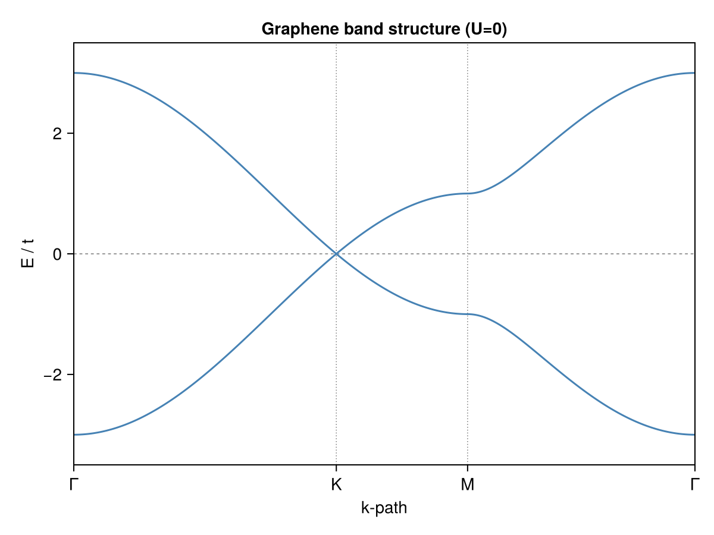
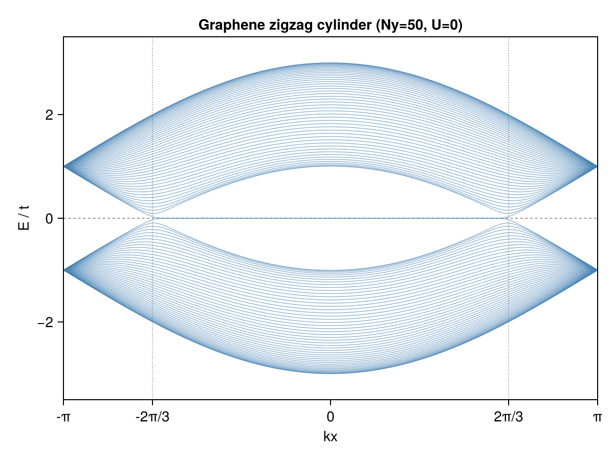
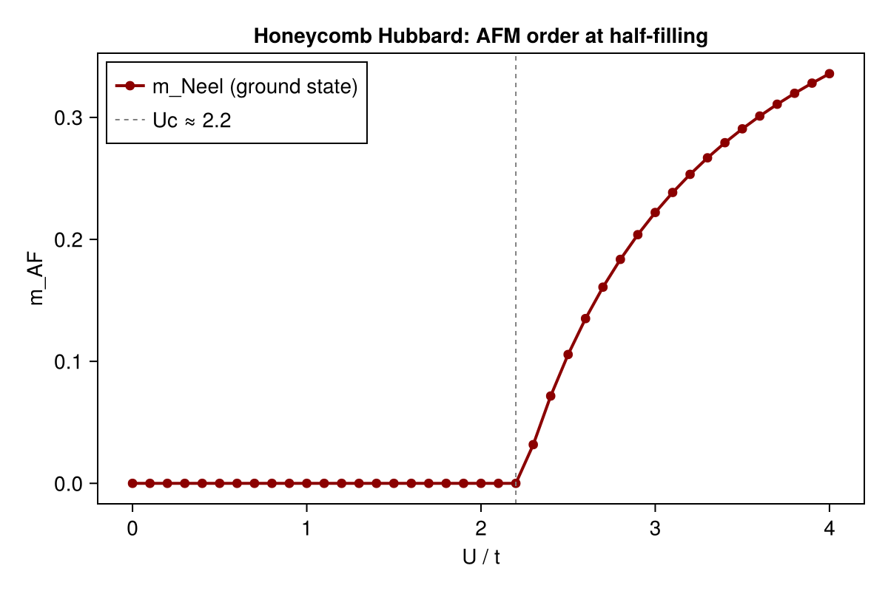
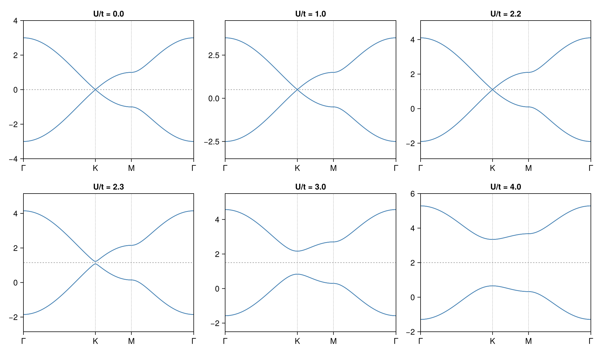

# Example: AFM Transition in Honeycomb Lattice Hubbard Model

This example demonstrates the antiferromagnetic (AFM) transition in the Hubbard model on a honeycomb lattice (graphene) at half-filling. A staggered magnetic moment develops on opposite sublattices beyond a critical coupling $U_c/t \approx 2.2$, opening a gap at the Dirac points.

The calculation requires **no prior knowledge of the ordered phase**: the ground state is found automatically using symmetry-breaking warmup restarts (see [⚠️ Critical Pitfall](hartreefock_momentum.md#critical-pitfall-scf-saddle-point-trapping) in the momentum-space HF documentation).

## Physical Model

$$H = -t \sum_{\langle ij \rangle,\sigma} (c^\dagger_{i\sigma}c_{j\sigma} + \text{h.c.}) + U \sum_i n_{i\uparrow}n_{i\downarrow}$$

- $t$: nearest-neighbor hopping (set to 1)
- $U$: on-site Coulomb repulsion
- Half-filling: 2 electrons per unit cell

The honeycomb lattice has two sublattices A and B. The mean-field AFM order parameter is:

$$m_{AF} = \frac{1}{2}\left|\frac{\langle S^z_A \rangle - \langle S^z_B \rangle}{2}\right|, \qquad \langle S^z_X \rangle = \frac{n_{X\uparrow} - n_{X\downarrow}}{2}$$

## Method

The calculation uses **momentum-space unrestricted Hartree-Fock** (`solve_hfk`) on a $100\times100$ $k$-grid. For each value of $U$, a single `solve_hfk` call with `n_restarts=5` and `field_strength=1.0` is used. Each restart injects a different random Hermitian symmetry-breaking field into the effective Hamiltonian for the first 15 SCF iterations, then gradually removes it, allowing the SCF to converge freely to the true ground state.

This replaces the old approach of running twice with hand-crafted AFM and PM initial conditions and is fully general: no knowledge of which phase to expect is required.

## Code

```julia
# System setup
dofs         = SystemDofs([Dof(:cell, 1), Dof(:sub, 2, [:A, :B]), Dof(:spin, 2, [:up, :dn])])
nn_bonds     = bonds(unitcell, (:p, :p), 1)
onsite_bonds = bonds(unitcell, (:p, :p), 0)

onebody_hop = generate_onebody(dofs, nn_bonds,
    (delta, qn1, qn2) -> qn1.spin == qn2.spin ? -t : 0.0)

kpoints = build_kpoints([a1, a2], (100, 100))
n_elec  = 2 * length(kpoints)   # half-filling

# Hubbard interaction
function build_U_ops(U)
    return generate_twobody(dofs, onsite_bonds,
        (deltas, qn1, qn2, qn3, qn4) ->
            (qn1.spin == qn2.spin) && (qn3.spin == qn4.spin) && (qn1.spin !== qn3.spin) ? U/2 : 0.0,
        order = (cdag, :i, c, :i, cdag, :i, c, :i))
end

# U sweep: ground state found automatically via symmetry-breaking restarts
for U in U_sweep
    U_ops   = build_U_ops(U)
    twobody = (ops=U_ops.ops, delta=U_ops.delta, irvec=U_ops.irvec)

    r = solve_hfk(dofs, onebody_hop, twobody, kpoints, n_elec;
        n_restarts     = 5,      # independent random restarts
        field_strength = 1.0,   # random symmetry-breaking field, O(t)
        n_warmup       = 15,     # field active for first 15 iters, then decays
        tol            = 1e-12,
        verbose        = false)

    m_afm = afm_order_parameter(r.G_k)
    phase = m_afm > 0.01 ? "AFM" : "PM"
    println(@sprintf("U = %.2f  E = %+.8f  m_AF = %.6f  %s", U, r.energies.total, m_afm, phase))
end
```

### Why `field_strength` is needed

Without the symmetry-breaking field, the paramagnetic (PM) solution acts as a **stable fixed point of the SCF map** even when it is not the ground state — every random restart converges to PM regardless of interaction strength:

```
# Without field_strength (old behavior): all 10 restarts → PM saddle point
Restart 1: E = -1.1491951239  (CONVERGED, 12 iters)   ← PM
Restart 2: E = -1.1491951239  (CONVERGED, 12 iters)   ← PM
...  (all 10 restarts identical)
```

With `field_strength = 1.0` and `n_warmup = 15`, each restart explores a different symmetry-broken direction and 8 out of 10 find the true AFM ground state:

```
# With field_strength=1.0, n_warmup=15, n_restarts=10
Restart 1: E = -1.1491951239  (CONVERGED, 45 iters)   ← PM (unlucky)
Restart 2: E = -1.3479535976  (CONVERGED, 29 iters)   ← AFM ground state ✓
Restart 3: E = -1.3479535998  (CONVERGED, 32 iters)   ← AFM ground state ✓
...
Restart 9: E = -1.3479535976  (CONVERGED, 28 iters)   ← AFM ground state ✓
Restart 10: E = -1.1491951239  (CONVERGED, 36 iters)  ← PM (unlucky)
```

The solver automatically returns the lowest-energy result.

## Running the Example

```bash
# Step 1: run HF solver and save results
julia --project=examples -t 8 examples/SM_AFM/run.jl

# Step 2: read data files and generate figures
julia --project=examples examples/SM_AFM/plot.jl
```

`run.jl` will:
1. Compute the U=0 graphene band structure along Γ–K–M–Γ and save to `bands_2d.dat`
2. Compute the zigzag cylinder band structure (edge states) and save to `bands_cyl.dat`
3. Sweep $U$ from 0 to 4 (41 points) using symmetry-breaking restarts
4. Compute the AFM order parameter $m_{AF}$ for each $U$ and save to `res.dat`
5. Compute mean-field band structures at selected $U$ values and save to `afm_bands.dat`

`plot.jl` will read the data files and generate figures in `docs/src/fig/`:
- `graphene_bands_2d.png`: 2D graphene band structure
- `graphene_bands_cylinder.png`: zigzag cylinder band structure
- `afm_order_parameter.png`: $m_{AF}$ vs $U$
- `afm_bands.png`: mean-field band structures at selected $U$ values

## Results

### Graphene Band Structure (U=0)



Linear dispersion near the K points (Dirac cones). Valence and conduction bands touch at K, making graphene a semi-metal.

### Zigzag Cylinder Band Structure (U=0)



Edge states appear in the gap region for a zigzag-edged cylinder, crossing the Fermi level at $k_x = \pm 2\pi/3$.

### AFM Order Parameter



The calculated critical coupling $U_c/t \approx 2.2$ agrees with mean-field theory predictions. Below $U_c$, $m_{AF} = 0$ (PM); above $U_c$, $m_{AF}$ grows continuously (AFM).

### Mean-Field Band Evolution



As $U$ increases beyond $U_c$, a gap opens at the Dirac points and the system transitions from a semi-metal to an AFM insulator.

## References

[1] S. Sorella and E. Tosatti, [Semi-metal-insulator transition of the Hubbard model in the honeycomb lattice](https://doi.org/10.1209/0295-5075/19/8/007), EPL 19 699 (1992).
