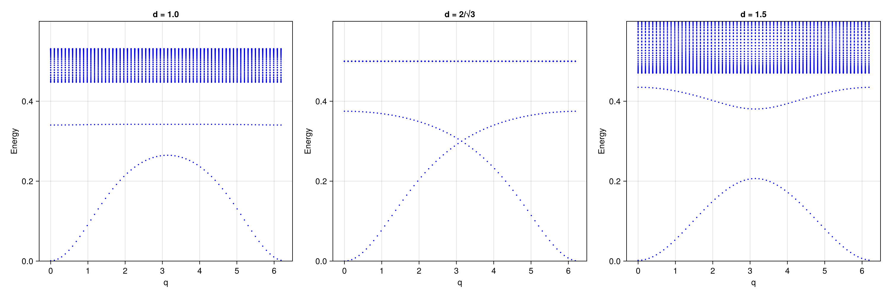

# Example: Ferromagnetic Excitations in the Tasaki Model

This example computes the particle-hole excitation spectrum of the Tasaki flat-band ferromagnet using the Tamm-Dancoff approximation (TDA) on top of Hartree-Fock. The Tasaki model is a decorated lattice model that supports an exact ferromagnetic ground state when the flat band is half-filled, providing a rigorous test case for the excitation solver.

## Physical Model

The Tasaki model is defined on a one-dimensional decorated lattice with two sublattices A (hub) and B (rim):

$$H = t \sum_{\langle ij \rangle \in \text{A-A},\sigma} c^\dagger_{i\sigma}c_{j\sigma} + td \sum_{\langle ij \rangle \in \text{A-B},\sigma} c^\dagger_{i\sigma}c_{j\sigma} + \sum_\sigma \left(\mu_A \sum_{i \in A} n_{i\sigma} + \mu_B \sum_{i \in B} n_{i\sigma}\right) + \sum_{\alpha} U_\alpha \sum_{i \in \alpha} n_{i\uparrow}n_{i\downarrow}$$

- $t = 1$: A-A hopping
- $td$: A-B hopping, controlled by the parameter $d$
- $\mu_A = 2t$, $\mu_B = td^2$: on-site potentials tuned to produce a flat band
- $U_A = U_B = t$: on-site Hubbard interaction on both sublattices

The B sublattice has no direct hopping ($t_{BB} = 0$). When the parameters satisfy the flat-band condition, the single-particle spectrum contains a completely dispersionless band. At quarter filling (one electron per site on the flat band), the ground state is an exact ferromagnet.

The parameter $d$ controls the band structure:
- **$d = 1$**: generic case with a gap between the flat band and the dispersive band
- **$d = 2/\sqrt{3}$**: critical point where the flat band touches the dispersive band (Dirac-like crossing)
- **$d = 1.5$**: larger hybridization, increased gap

## Method

The calculation uses **momentum-space Hartree-Fock** (`solve_hfk`) on a 1D $k$-grid of 64 points along the chain direction. The ferromagnetic ground state is found via symmetry-breaking restarts. The particle-hole excitation spectrum is then computed using `solve_ph_excitations` with `solver=:TDA` and `n_list=[1,2]` to restrict the particle space to the two lowest bands.

## Code

```julia
dofs = SystemDofs([Dof(:cell, 1), Dof(:sub, 2, [:A, :B]), Dof(:spin, 2, [:up, :dn])])

kpoints = [[r, 0.0] for r in range(0, 2pi, length=65)[1:end-1]]
n_elec  = length(kpoints)   # quarter filling (1 electron per k-point)

for d in [1.0, 2.0/sqrt(3), 1.5]
    mub = t * d^2

    # Hopping: A-A with amplitude t, A-B with amplitude t*d, B-B = 0
    onebody_h = generate_onebody(dofs, nn_bonds,
        (delta, qn1, qn2) -> begin
            qn1.spin !== qn2.spin && return 0.0
            qn1.sub == qn2.sub == 2 && return 0.0
            qn1.sub == qn2.sub == 1 && return t
            return t * d
        end)

    # On-site potential
    onebody_m = generate_onebody(dofs, onsite_bonds,
        (delta, qn1, qn2) -> begin
            qn1.spin !== qn2.spin && return 0.0
            qn1.sub == 1 ? mua : mub
        end, order = (cdag, :i, c, :i))

    hf = solve_hfk(dofs, onebody, twobody, kpoints, n_elec;
        n_restarts = 10, field_strength = 1.0, n_warmup = 15, tol = 1e-12)

    ph = solve_ph_excitations(dofs, onebody, twobody, hf, kpoints, [[2pi, 0.0]];
        n_list = [1, 2], solver = :TDA)
end
```

### Role of `n_list`

The `n_list=[1,2]` parameter restricts the unoccupied (particle) states to bands 1 and 2, excluding bands 3 and 4. This is physically motivated: in the Tasaki model, the relevant low-energy excitations involve transitions within the two lowest bands (the flat band and its adjacent dispersive band). Including higher bands introduces artificial level repulsion that opens a spurious gap at the band-crossing point.

## Running the Example

```bash
julia --project=examples examples/Tasaki/tasaki.jl
```

The script will:
1. Loop over three values of $d = 1.0,\ 2/\sqrt{3},\ 1.5$
2. For each $d$, solve the HF ground state and compute the TDA excitation spectrum
3. Plot all three spectra as separate panels and save to `docs/src/fig/tasaki.png`

## Results



Three panels show the TDA particle-hole excitation spectrum for different values of $d$:

- **$d = 1.0$** (left): The flat band is well separated from the dispersive band. The excitation spectrum shows a clear gap.
- **$d = 2/\sqrt{3}$** (center): At the critical hybridization, the flat band touches the dispersive band, producing a gapless Dirac-like crossing in the excitation spectrum at $q = \pi$.
- **$d = 1.5$** (right): Larger hybridization reopens the gap in the excitation spectrum.

The gapless point at $d = 2/\sqrt{3}$ is a characteristic feature of the Tasaki model and provides a stringent test of the TDA solver: the excitation gap must close exactly at this parameter value.

## References

[1] W.-T. Zhou, Z.-Y. Dong, and J.-X. Li, [Interaction-Driven Spin Polaron in Itinerant Flat-Band Ferromagnetism](https://arxiv.org/abs/2602.09545), arXiv:2602.09545.
